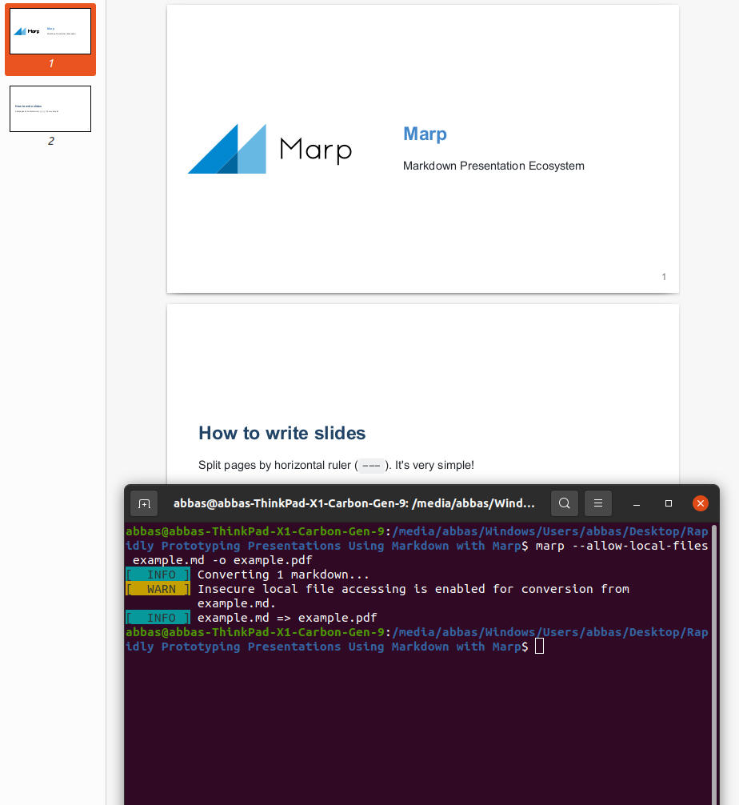
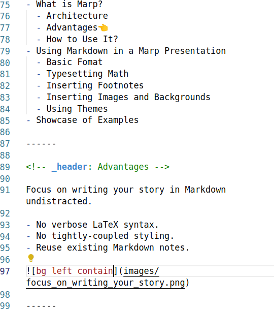
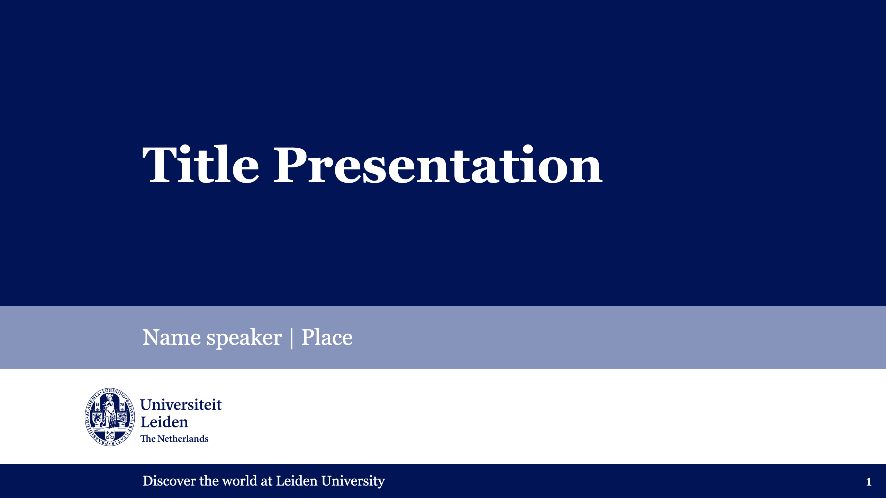
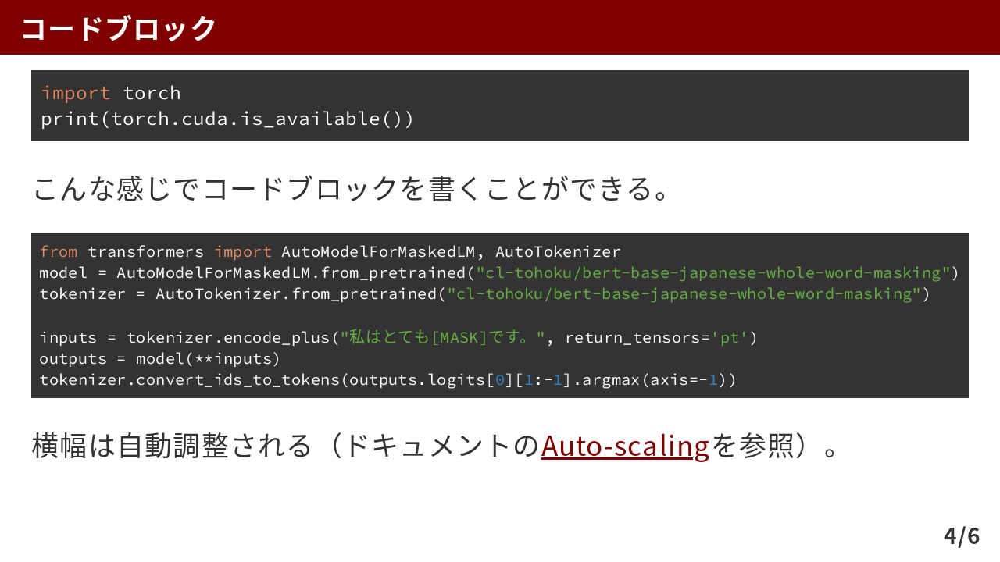
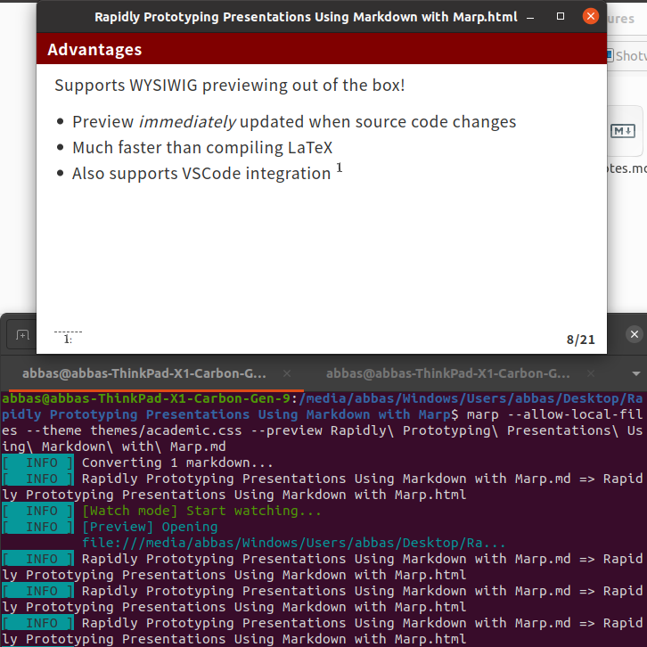
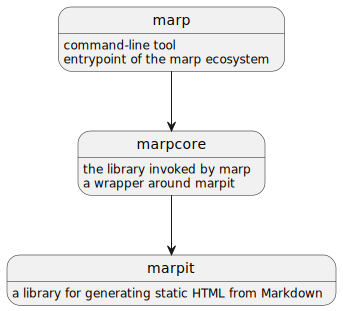
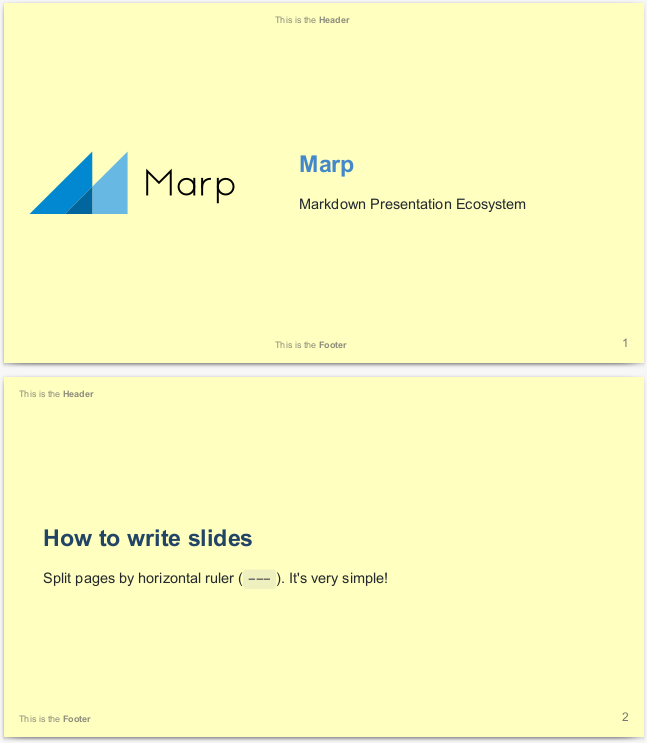
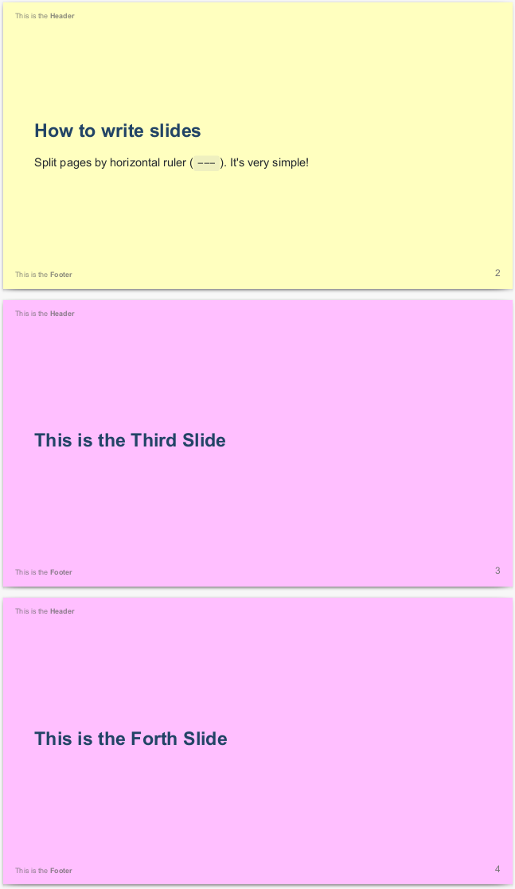
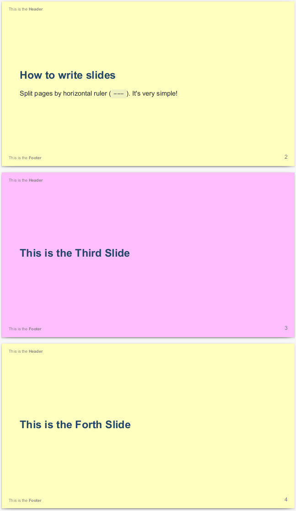
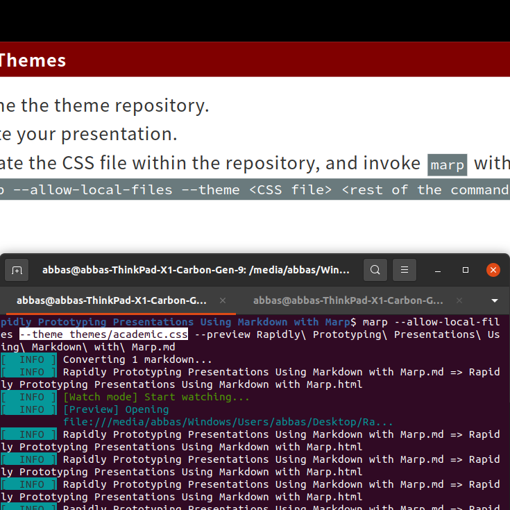

<!-- _class: lead -->

# Rapidly Prototyping Presentations Using Markdown with Marp

Jifeng Wu

March 17, 2023

------

<!-- header: Contents -->

- What is Marp?
  - Architecture👈
  - Advantages
  - How to Use It?
- Using Markdown in a Marp Presentation
  - Directives
  - Typesetting Math
  - Inserting Footnotes
  - Inserting Images and Backgrounds
  - Using Themes
- Showcase of Examples

------

<!-- header: Architecture -->

- In the need to create a *decent*, *academic* presentation *fast*?
- LaTeX overly verbose?
- No time to spend on adjusting style？
- Have notes written in Markdown?


------

## The Solution

Create presentations with Markdown using Marp!

```markdown
---
marp: true
paginate: true
---


# **Marp**

Markdown Presentation Ecosystem

---

# How to write slides

Split pages by horizontal ruler (`---`). It's very simple!

```



------

<!-- header: Contents -->

- What is Marp?
  - Architecture
  - Advantages👈
  - How to Use It?
- Using Markdown in a Marp Presentation
  - Directives
  - Typesetting Math
  - Inserting Footnotes
  - Inserting Images and Backgrounds
  - Using Themes
- Showcase of Examples

------

<!-- header: Advantages -->

Focus on writing your story in Markdown undistracted.

- No verbose LaTeX syntax.
- No tightly-coupled styling.
- Reuse existing Markdown notes.



------

- Lots of themes! $^1$
- Also easy to modify one or create your own.
  - Vanilla CSS
  - No LaTeX Black Magic!

```css
header {
  background-color: #800000;
  color: #fff;
  font-size: 1em;
  font-weight: 700;
}
```

> $1$: https://github.com/topics/marp-themes




------

Supports WYSIWIG previewing out of the box!

- Preview *immediately* updated when source code changes
- Much faster than compiling LaTeX
- Also supports VSCode integration $^1$



> $1$: https://marketplace.visualstudio.com/items?itemName=marp-team.marp-vscode

------

Generates self-contained files for sharing:

- Vector:
  - HTML
  - PDF
- Raster:
  - PNG
  - JPEG


------

Open-source and extensible framework

- Written in TypeScript
- Lots of usable plugins



> https://github.com/marp-team/marp-cli
> https://github.com/marp-team/marp-core
> https://github.com/marp-team/marpit

------

<!-- header: Contents -->

- What is Marp?
  - Architecture
  - Advantages
  - How to Use It?👈
- Using Markdown in a Marp Presentation
  - Directives
  - Typesetting Math
  - Inserting Footnotes
  - Inserting Images and Backgrounds
  - Using Themes
- Showcase of Examples

------

<!-- header: How to Use It? -->

Marp is an open-source and extensible framework written in *TypeScript*.

1. Install `node`.
2. `npm install -g @marp-team/marp-cli`.
3. Now you can use `marp` from the command-line. It's the entry point to everything we do with the Marp framework.
4. Google Chrome or Microsoft Edge required to convert to PDF.

> Other installation methods: https://github.com/marp-team/marp-cli

------

## WYSIWIG Previewing

The preview updates every time the Markdown file is saved.

```bash
marp \
--allow-local-files \
--preview \
<other options> \
<Markdown file>
```


------

## Generating a Standalone HTML or PDF File

Google Chrome or Microsoft Edge required to output PDF.

```bash
marp \
--allow-local-files \
<other options> \
<Markdown file> \
-o <output file ending with .html or .pdf>
```


------

<!-- header: Contents -->

- What is Marp?
  - Architecture
  - Advantages
  - How to Use It?
- Using Markdown in a Marp Presentation
  - Directives👈
  - Typesetting Math
  - Inserting Footnotes
  - Inserting Images and Backgrounds
  - Using Themes
- Showcase of Examples

------

<!--
header: Directives
-->

Directives allow fine-tuning not supported by Markdown itself.

- Content
  - `paginate`: Show page number on a slide. `true` or `false`.
  - `header`: The content to display at the top of a slide. String containing Markdown that renders to the HTML `<header>` element.
  - `footer`: The content to display at the bottom of a slide. String containing Markdown that renders to the HTML `<footer>` element.

> Read more at: https://marpit.marp.app/directives

------

Directives allow fine-tuning not supported by Markdown itself.

- Appearance
  - `class`: Modifies the `class` property of the HTML `<section>` element a slide renders to. String.
  - `backgroundColor`, `backgroundImage`, `backgroundPosition`, `backgroundRepeat`, `backgroundSize`: Set the background$^1$ of the `<section>` element a slide renders to. Each a CSS property value.
  - `color`: Adjust the text color$^2$ of a slide. CSS property value.
  - `style` Tweak theme with CSS. Renders to the HTML `<style>` element. CSS String.

> $1$: https://developer.mozilla.org/en-US/docs/Web/CSS/background-image
> $2$: https://developer.mozilla.org/en-US/docs/Web/CSS/color

------

To *globally* set the value of a directive, include it as part of the *YAML front-matter*, at the very beginning of the Markdown file.

```markdown
---
paginate: true
header: This is the **Header**
footer: This is the **Footer**
backgroundColor: rgba(255, 255, 128, .5)
---
```



> Read more at: https://marpit.marp.app/directives

------

To set the value of a directive for *the defined page and following pages*, include it within an HTML comment on that page.

```markdown
<!--
backgroundColor: rgba(255, 128, 255, .5)
-->
```



> Read more at: https://marpit.marp.app/directives

------

To set the value of a directive for *the defined page only*, include it within an HTML comment on that page, but with a `_` in front of each directive.

```markdown
<!--
_backgroundColor: rgba(255, 128, 255, .5)
-->
```



> Read more at: https://marpit.marp.app/directives

------

<!-- header: Contents -->

- What is Marp?
  - Architecture
  - Advantages
  - How to Use It?
- Using Markdown in a Marp Presentation
  - Directives
  - Typesetting Math👈
  - Inserting Footnotes
  - Inserting Images and Backgrounds
  - Using Themes
- Showcase of Examples

------

<!-- header: Typesetting Math -->

```markdown
Render inline math such as $ax^2+bc+c$.
```

Render inline math such as $ax^2+bc+c$.


```markdown
Render block math such as:

$$
f(x) = \int_{-\infty}^\infty
    \hat f(\xi)\,e^{2 \pi i \xi x}
    \,d\xi
$$
```

$$
f(x) = \int_{-\infty}^\infty
    \hat f(\xi)\,e^{2 \pi i \xi x}
    \,d\xi
$$

------

<!-- header: Contents -->

- What is Marp?
  - Architecture
  - Advantages
  - How to Use It?
- Using Markdown in a Marp Presentation
  - Directives
  - Typesetting Math
  - Inserting Footnotes👈
  - Inserting Images and Backgrounds
  - Using Themes
- Showcase of Examples

------

<!-- header: Inserting Footnotes -->

It is possible to render blockquotes as footnotes$^1$:

```markdown
---
style: |
  blockquote {
      border-top: 0.1em dashed #555;
      font-size: 60%;
      margin-top: auto;
  }
---
```

Add footnotes using `> 1: https://www.google.com` and cite using `$^1$`.

> 1: https://github.com/marp-team/marp/discussions/150

------

<!-- header: Contents -->

- What is Marp?
  - Architecture
  - Advantages
  - How to Use It?
- Using Markdown in a Marp Presentation
  - Directives
  - Typesetting Math
  - Inserting Footnotes
  - Inserting Images and Backgrounds👈
  - Using Themes
- Showcase of Examples

------

<!-- header: Inserting Images and Backgrounds -->

There are two types of images in Marp:

- Inline Images
- Background Images

------


Inline images are directly inserted into the slide. They can be resized using `width` and `height`:

```markdown
  
```

 

------

To be able to center them, add this$^1$:

```markdown
---
style: |
  img[alt~="center"] {
    display: block;
    margin: 0 auto;
  }
---
```

This allows you to use `center` to center inline images.

```markdown
  
```

> $1$: https://github.com/marp-team/marpit/issues/141

------

Compared with inline images, background images are much more interesting. Not only can you use them to set an image as the background of a slide:

```markdown

```

- `contain` scales the image to fit within the slide.👈
- `cover` scales the image to fill the slide.


------

Compared with inline images, background images are much more interesting. Not only can you use them to set an image as the background of a slide:

```markdown

```

- `contain` scales the image to fit within the slide.
- `cover` scales the image to fill the slide.👈


------

you can also use this as a feature to stack multiple pictures horizontally:

```markdown


```

- `contain` scales the image to fit within the slide.👈
- `cover` scales the image to fill the slide.


------

or vertically:

```markdown


```

- `contain` scales the image to fit within the slide.
- `cover` scales the image to fill the slide.👈


------

You can also use `bg` with `left:<percentage>` or `right:<percentage>` to split the slide into a picture section and a text section:

```markdown

```

- `contain` scales the image to fit within the slide.👈
- `cover` scales the image to fill the slide.


------

You can also use `bg` with `left:<percentage>` or `right:<percentage>` to split the slide into a picture section and a text section:

```markdown

```

- `contain` scales the image to fit within the slide.
- `cover` scales the image to fill the slide.👈


------

In this setting, we can also stack multiple pictures horizontally:

```markdown


```

- `contain` scales the image to fit within the slide.👈
- `cover` scales the image to fill the slide.


------

or vertically:

```markdown


```

- `contain` scales the image to fit within the slide.
- `cover` scales the image to fill the slide.👈


------

<!-- header: Contents -->

- What is Marp?
  - Architecture
  - Advantages
  - How to Use It?
- Using Markdown in a Marp Presentation
  - Directives
  - Typesetting Math
  - Inserting Footnotes
  - Inserting Images and Backgrounds
  - Using Themes👈
- Showcase of Examples

------

<!-- header: Using Themes -->

- Lots of themes! $^1$
- Also easy to modify one or create your own.
  - Vanilla CSS
  - No LaTeX Black Magic!

```css
header {
  background-color: #800000;
  color: #fff;
  font-size: 1em;
  font-weight: 700;
}
```

> $1$: https://github.com/topics/marp-themes


------

1. Clone the theme repository.
2. Find the CSS file.
3. `marp --allow-local-files --theme <CSS file> <rest of the command>`.



------

<!-- header: Contents -->

- What is Marp?
  - Architecture
  - Advantages
  - How to Use It?
- Using Markdown in a Marp Presentation
  - Directives
  - Typesetting Math
  - Inserting Footnotes
  - Inserting Images and Backgrounds
  - Using Themes
- Showcase of Examples👈
